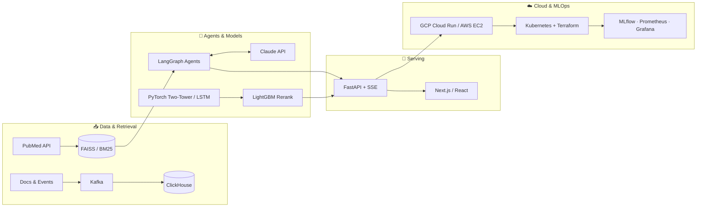
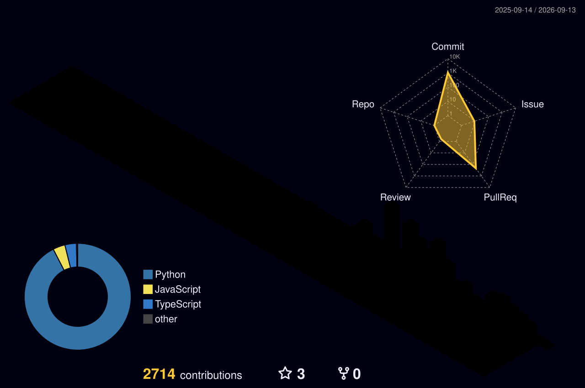
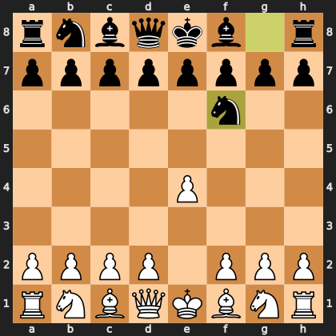
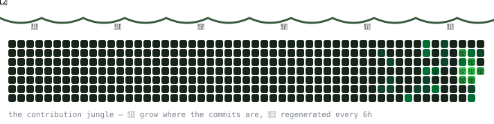

> **⚠️ All Rights Reserved.** This repository is published for viewing and portfolio purposes only. The code is **not** open source — reuse, redistribution, modification, or derivative works are not permitted without written permission. See [LICENSE](./LICENSE).
<div align="center">

<!-- UNIVERSE MOVING BACKGROUND -->


<!-- TYPING ANIMATION — ALL 6 PROJECTS -->


<br/>

[](https://www.linkedin.com/in/rohith-kandula19/)
[](https://github.com/rohithkandula19/Ronin)
[](https://romedrag.me)
[](https://bullshiftdetector.web.app)
[](https://mrbusportal.com)
[](https://rover-ai.duckdns.org)
[](#)
[](https://www.rohithkandula.com)

<br/>


</div>

---

<div align="center"><h2>🌌 WHO AM I</h2></div>

I'm an AI/ML Engineer who gets a kick out of taking ideas from zero to production. Not the kind who fine-tunes a model in a notebook and calls it a day -- I mean actually shipping things: APIs, cloud deployments, real users, real data.

I've spent the last 4+ years obsessing over the full stack of AI -- from training PyTorch models and building RAG pipelines to wiring up Kafka event streams and deploying on GCP and AWS. If it involves LLMs, agents, or real-time ML, I've probably broken it three times and shipped it on the fourth.

Right now I'm building toward roles at companies that actually push the frontier -- Anthropic, OpenAI, Google DeepMind. Not because of the hype, but because I genuinely care about where this technology goes.

```python
rohith = {
    "location"  : "Charlotte, NC",
    "education" : "MS Information Technology -- University of Cincinnati (GPA: 3.89)",
    "cert"      : "AWS Solutions Architect Associate",
    "currently" : "Building production AI systems. Shipping. Repeating.",
    "targeting" : ["Anthropic", "OpenAI", "Google DeepMind", "Meta AI"],
    "status"    : "Open to AI Engineer | GenAI | LLM | MLOps -- US",
}
```

---

<div align="center"><h2>🗡️ OPEN SOURCE — RONIN</h2></div>

### [Ronin — a masterless, provider-agnostic AI coding agent](https://github.com/rohithkandula19/Ronin)

[](https://github.com/rohithkandula19/Ronin)


A Claude-Code-style terminal agent that reads, edits, and runs your code -- every write behind a diff you approve. Built on a **provider-agnostic** framework, so the same agent runs on Claude for top quality or **free** on Gemini / Cerebras / Groq / Ollama (`--offline` strips every network tool for air-gapped coding). The multi-provider design unlocks things a single-vendor agent structurally can't:

- **Consensus** -- run a task across several models in parallel; a judge synthesizes one cross-checked answer
- **Dojo** -- rival models each attempt the same change in isolated git worktrees; a judge picks the best diff
- **Kaizen** -- the agent finds a weakness in its *own* source, fixes it in a worktree, and keeps the diff only if the test suite passes

```
Python  ->  7-package monorepo  ->  1,376 offline tests  ->  MCP + 200 plugins
```


---

<div align="center">
<h2>🚀 THINGS I'VE BUILT AND SHIPPED</h2>
<p><i>6 production systems. All live. All mine.</i></p>
</div>

<table>
<tr>
<td width="50%" valign="top">

### 🧠 [RO MedRAG](https://romedrag.me)
[](https://romedrag.me)

Medical research is buried in millions of papers. I built an agentic RAG system that searches PubMed in real-time, pulls the right papers, and synthesizes clinical answers using Claude Sonnet -- all streamed live to the user.

```
LangGraph -> FAISS -> PubMed API -> Claude Sonnet
FastAPI -> GCP Cloud Run -> PostgreSQL -> SSE
```


</td>
<td width="50%" valign="top">

### 🎯 [RO AI Recommendation Engine](https://github.com/rohithkandula19/ro-ai-recommendation-engine)
[](https://github.com/rohithkandula19/ro-ai-recommendation-engine)

I got curious about how Netflix actually works under the hood -- so I built it. A proper two-tower PyTorch model with BPR loss, 4-source candidate generation, LightGBM reranking, and a Kafka event pipeline on Kubernetes.

```
PyTorch BPR -> FAISS IVFPQ -> LightGBM LTR -> MMR
Kafka -> ClickHouse -> Kubernetes HPA -> Terraform EKS
```


</td>
</tr>
<tr>
<td width="50%" valign="top">

### 💩 [BullshiftDetector](https://bullshiftdetector.web.app)
[](https://bullshiftdetector.web.app)

I got tired of seeing "Humbled and excited to announce" for the 50th time. So I built a Claude-powered detector that scores LinkedIn posts for corporate cringe (0-100), generates a one-line roast, and rewrites it like a normal human. Because someone had to.

```
Claude API -> FastAPI -> Next.js 14
GCP Cloud Run -> Firebase Hosting
```


</td>
<td width="50%" valign="top">

### 📊 [ROVA AI Forecasting](https://github.com/rohithkandula19/rova-ai-forecasting)
[](https://github.com/rohithkandula19/rova-ai-forecasting)

A full ML forecasting platform with a proper pipeline -- PyTorch NN + LSTM ensemble, 128-dimensional feature engineering, SHAP attributions for explainability, and KL-divergence drift detection that auto-retrains when the distribution shifts. 14 screens on GCP.

```
PyTorch NN + LSTM -> MLflow -> Celery + Redis
Prometheus + Grafana -> GCP Cloud Run
```


</td>
</tr>
<tr>
<td width="50%" valign="top">

### 🔍 [RO Fraud Detection](https://rover-ai.duckdns.org)
[](https://rover-ai.duckdns.org)

Enterprise fraud detection with LangGraph agents doing the heavy lifting -- real-time risk scoring, multi-step reasoning on each transaction, full audit trail on every decision. Deployed on AWS EC2 with Nginx and SSL. Actually production-grade.

```
LangGraph Agents -> FastAPI -> SQLAlchemy
AWS EC2 -> Docker -> Nginx -> Let's Encrypt
```


</td>
<td width="50%" valign="top">

### 🚌 [MR Buses](https://mrbusportal.com)
[](https://mrbusportal.com)

A full interstate bus booking platform with an AI chatbot that actually knows the routes, schedules, and can help you book -- not just answer FAQs. Google OAuth, real-time seat booking, admin dashboard. Live on GCP.

```
LangChain RAG -> FastAPI -> GCP Cloud Run
Cloud SQL PostgreSQL -> Firebase Hosting
```


</td>
</tr>
</table>

---

<div align="center"><h2>🛰️ LIVE STATUS</h2>
<p><i>"All live" isn't a slogan — a GitHub Action pings every deployment and rewrites this table. Receipts, not vibes.</i></p></div>

<div align="center">

<!-- STATUS:START -->
| System | Status | Response |
|---|---|---|
| [RO MedRAG](https://romedrag.me) | 🟢 LIVE | 118 ms |
| [BullshiftDetector](https://bullshiftdetector.web.app) | 🟢 LIVE | 187 ms |
| [MR Buses](https://mrbusportal.com) | 🟢 LIVE | 124 ms |
| [RO Fraud Detection](https://rover-ai.duckdns.org) | 🟡 SLOW | 3746 ms |

<sub>🤖 Checked automatically every 6 hours by GitHub Actions — last run 2026-06-10 16:42 UTC</sub>
<!-- STATUS:END -->

</div>

<div align="center"><h3>⚡ Recently shipped</h3></div>

<!-- SHIPPED:START -->
- **[Ronin](https://github.com/rohithkandula19/Ronin)** · pushed 2026-06-10 — Masterless, terminal-native coding agent (Claude Code-style: reads, edits, runs code) f…
- **[Ro-MedRag](https://github.com/rohithkandula19/Ro-MedRag)** · pushed 2026-06-10 — Production agentic RAG system for medical literature analysis. LangGraph + Claude Sonne…
- **[ro-ai-recommendation-engine](https://github.com/rohithkandula19/ro-ai-recommendation-engine)** · pushed 2026-06-04
- **[mr-bus-portal](https://github.com/rohithkandula19/mr-bus-portal)** · pushed 2026-06-04
- **[Ro-Cortex](https://github.com/rohithkandula19/Ro-Cortex)** · pushed 2026-06-04
<!-- SHIPPED:END -->

---

<div align="center"><h2>🛠️ STACK</h2></div>



<div align="center">

**AI / ML**


**Backend / Data**


**Cloud / MLOps**


**Frontend**


</div>

---

<div align="center"><h2>📊 GITHUB STATS</h2></div>

<div align="center">




</div>

---

<div align="center"><h2>🕹️ THE ARCADE</h2>
<p><i>This profile is playable. Yes, really.</i></p></div>

<!-- CHESS:START -->
<div align="center">

**♟️ Play chess against my profile.** You (the internet) are **White**; a Stockfish bot is **Black**.
Click a move → a pre-filled GitHub issue opens → press *Create* → a GitHub Action plays it, gets Stockfish's reply, and re-renders this board.




**Your move:** [`Ba6`](https://github.com/rohithkandula19/rohithkandula19/issues/new?title=chess%7Cmove%7CBa6&body=Just%20press%20%27Create%27%20%E2%80%94%20the%20bot%20does%20the%20rest.) · [`Bb5`](https://github.com/rohithkandula19/rohithkandula19/issues/new?title=chess%7Cmove%7CBb5&body=Just%20press%20%27Create%27%20%E2%80%94%20the%20bot%20does%20the%20rest.) · [`Bc4`](https://github.com/rohithkandula19/rohithkandula19/issues/new?title=chess%7Cmove%7CBc4&body=Just%20press%20%27Create%27%20%E2%80%94%20the%20bot%20does%20the%20rest.) · [`Bd3`](https://github.com/rohithkandula19/rohithkandula19/issues/new?title=chess%7Cmove%7CBd3&body=Just%20press%20%27Create%27%20%E2%80%94%20the%20bot%20does%20the%20rest.) · [`Be2`](https://github.com/rohithkandula19/rohithkandula19/issues/new?title=chess%7Cmove%7CBe2&body=Just%20press%20%27Create%27%20%E2%80%94%20the%20bot%20does%20the%20rest.) · [`Ke2`](https://github.com/rohithkandula19/rohithkandula19/issues/new?title=chess%7Cmove%7CKe2&body=Just%20press%20%27Create%27%20%E2%80%94%20the%20bot%20does%20the%20rest.) · [`Na3`](https://github.com/rohithkandula19/rohithkandula19/issues/new?title=chess%7Cmove%7CNa3&body=Just%20press%20%27Create%27%20%E2%80%94%20the%20bot%20does%20the%20rest.) · [`Nc3`](https://github.com/rohithkandula19/rohithkandula19/issues/new?title=chess%7Cmove%7CNc3&body=Just%20press%20%27Create%27%20%E2%80%94%20the%20bot%20does%20the%20rest.) · [`Ne2`](https://github.com/rohithkandula19/rohithkandula19/issues/new?title=chess%7Cmove%7CNe2&body=Just%20press%20%27Create%27%20%E2%80%94%20the%20bot%20does%20the%20rest.) · [`Nf3`](https://github.com/rohithkandula19/rohithkandula19/issues/new?title=chess%7Cmove%7CNf3&body=Just%20press%20%27Create%27%20%E2%80%94%20the%20bot%20does%20the%20rest.) · [`Nh3`](https://github.com/rohithkandula19/rohithkandula19/issues/new?title=chess%7Cmove%7CNh3&body=Just%20press%20%27Create%27%20%E2%80%94%20the%20bot%20does%20the%20rest.) · [`Qe2`](https://github.com/rohithkandula19/rohithkandula19/issues/new?title=chess%7Cmove%7CQe2&body=Just%20press%20%27Create%27%20%E2%80%94%20the%20bot%20does%20the%20rest.) · [`Qf3`](https://github.com/rohithkandula19/rohithkandula19/issues/new?title=chess%7Cmove%7CQf3&body=Just%20press%20%27Create%27%20%E2%80%94%20the%20bot%20does%20the%20rest.) · [`Qg4`](https://github.com/rohithkandula19/rohithkandula19/issues/new?title=chess%7Cmove%7CQg4&body=Just%20press%20%27Create%27%20%E2%80%94%20the%20bot%20does%20the%20rest.) · [`Qh5`](https://github.com/rohithkandula19/rohithkandula19/issues/new?title=chess%7Cmove%7CQh5&body=Just%20press%20%27Create%27%20%E2%80%94%20the%20bot%20does%20the%20rest.) · [`a3`](https://github.com/rohithkandula19/rohithkandula19/issues/new?title=chess%7Cmove%7Ca3&body=Just%20press%20%27Create%27%20%E2%80%94%20the%20bot%20does%20the%20rest.) · [`a4`](https://github.com/rohithkandula19/rohithkandula19/issues/new?title=chess%7Cmove%7Ca4&body=Just%20press%20%27Create%27%20%E2%80%94%20the%20bot%20does%20the%20rest.) · [`b3`](https://github.com/rohithkandula19/rohithkandula19/issues/new?title=chess%7Cmove%7Cb3&body=Just%20press%20%27Create%27%20%E2%80%94%20the%20bot%20does%20the%20rest.) · [`b4`](https://github.com/rohithkandula19/rohithkandula19/issues/new?title=chess%7Cmove%7Cb4&body=Just%20press%20%27Create%27%20%E2%80%94%20the%20bot%20does%20the%20rest.) · [`c3`](https://github.com/rohithkandula19/rohithkandula19/issues/new?title=chess%7Cmove%7Cc3&body=Just%20press%20%27Create%27%20%E2%80%94%20the%20bot%20does%20the%20rest.) · [`c4`](https://github.com/rohithkandula19/rohithkandula19/issues/new?title=chess%7Cmove%7Cc4&body=Just%20press%20%27Create%27%20%E2%80%94%20the%20bot%20does%20the%20rest.) · [`d3`](https://github.com/rohithkandula19/rohithkandula19/issues/new?title=chess%7Cmove%7Cd3&body=Just%20press%20%27Create%27%20%E2%80%94%20the%20bot%20does%20the%20rest.) · [`d4`](https://github.com/rohithkandula19/rohithkandula19/issues/new?title=chess%7Cmove%7Cd4&body=Just%20press%20%27Create%27%20%E2%80%94%20the%20bot%20does%20the%20rest.) · [`e5`](https://github.com/rohithkandula19/rohithkandula19/issues/new?title=chess%7Cmove%7Ce5&body=Just%20press%20%27Create%27%20%E2%80%94%20the%20bot%20does%20the%20rest.)

<details><summary>Recent moves</summary>

<sub>⚪ e4 — @rohithkandula19</sub>  
<sub>⚫ Nf6 — Stockfish</sub>

</details>

<sub>Any legal move works: open an issue titled <code>chess|move|&lt;SAN&gt;</code> (e.g. <code>chess|move|Nf3</code>) · [Start a new game](https://github.com/rohithkandula19/rohithkandula19/issues/new?title=chess%7Cnew&body=Just%20press%20%27Create%27%20%E2%80%94%20the%20bot%20does%20the%20rest.)</sub>

</div>
<!-- CHESS:END -->

<div align="center">

<picture>
  <source media="(prefers-color-scheme: dark)" srcset="dist/pacman-contribution-graph-dark.svg">
  
</picture>



</div>

---

<div align="center"><h2>🏆 CREDENTIALS</h2></div>

<div align="center">

| Credential | Details |
|---|---|
| [Claude with Google Cloud's Vertex AI](https://verify.skilljar.com/c/6nrrh5xfejxq) | Anthropic Education -- May 2026 |
| [Claude 101](https://verify.skilljar.com/c/jqz4es75zbxm) | Anthropic -- Apr 2026 |
| [AI Fluency: Framework & Foundations](https://verify.skilljar.com/c/2f42572kjdgg) | Anthropic -- Apr 2026 |
| AWS Certified Solutions Architect -- Associate | Amazon Web Services -- May 2025 (exp. May 2028) |
| MS, Information Technology | University of Cincinnati -- GPA 3.89 -- Dec 2024 |
| Deep Learning Specialization | Andrew Ng / DeepLearning.AI -- 2024 |
| LangChain & LLM Agents for Production | DeepLearning.AI -- 2024 |

</div>

---

<div align="center">


[](https://linkedin.com/in/rohith-kandula19)
[](https://www.rohithkandula.com)

<sub>🤖 The portfolio has an AI narrator and an "Ask Rohith" chat — and it rewrites itself depending on whether you're a recruiter, an engineer, or just curious. Go say hi.</sub>

</div>