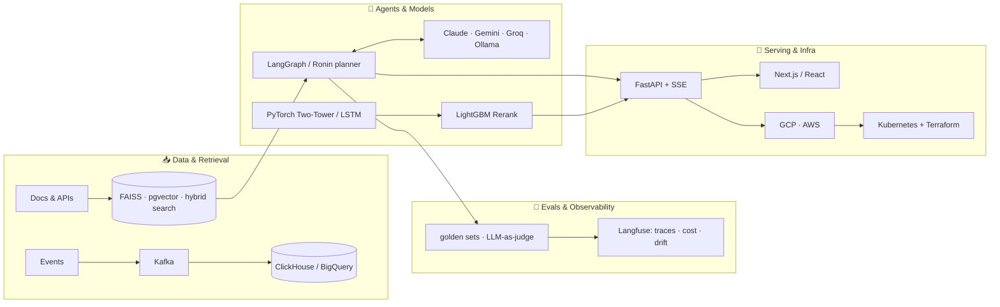

<div align="center">

<!-- UNIVERSE MOVING BACKGROUND -->


<!-- TYPING ANIMATION · RONIN FIRST -->


<br/>

[](https://github.com/rohithkandula19/Ronin)
[](https://github.com/rohithkandula19/Ronin)
[](https://www.rohithkandula.com)
[](https://www.linkedin.com/in/rohith-kandula19/)

</div>

---

<div align="center"><h2>🗡️ RONIN</h2>
<p><i>The thing I want you to look at first.</i></p>
</div>

### [A masterless, provider-agnostic AI coding agent](https://github.com/rohithkandula19/Ronin)

[](https://github.com/rohithkandula19/Ronin)


Ronin is a Claude-Code-style terminal agent: it reads, edits, and runs your code, and every write sits behind a diff you approve. The stack is **provider-agnostic**, so the same agent runs on Claude when you want quality, or free on Gemini / Cerebras / Groq / Ollama. `--offline` strips every network tool for air-gapped work.

Multi-provider is the point, not a toggle:

- **Consensus** — several models run the same task; a judge returns one cross-checked answer
- **Dojo** — rival models each attempt the change in isolated git worktrees; a judge keeps the best diff
- **Kaizen** — the agent finds a weakness in *its own* source, patches it in a worktree, and keeps the diff only if tests pass

```
Python  →  7-package monorepo  →  1,376 offline tests  →  MCP + 200 plugins
```

If you only click one link on this profile: **[star / clone Ronin](https://github.com/rohithkandula19/Ronin)**.

---

<div align="center"><h2>🌌 WHO AM I</h2></div>

AI/ML engineer in Charlotte. I ship agents and production ML — APIs, cloud, real users — not notebook demos.

Most of that energy now goes into **Ronin**. The other systems below are how I learned to put LLM and ML systems on the internet and keep them there.

```python
rohith = {
    "location"  : "Charlotte, NC",
    "education" : "MS Information Technology, University of Cincinnati (GPA: 3.89)",
    "cert"      : "AWS Solutions Architect Associate",
    "currently" : "Building Ronin. Shipping the rest.",
    "status"    : "Open to AI Engineer | GenAI | LLM roles (US)",
}
```

---

<div align="center">
<h2>🚀 ALSO SHIPPED</h2>
<p><i>Live systems. Useful context. Not the main plot.</i></p>
</div>

<table>
<tr>
<td width="50%" valign="top">

### 🧠 [RO MedRAG](https://romedrag.me)
[](https://romedrag.me)

Agentic RAG over PubMed. Searches, pulls papers, synthesizes clinical answers with Claude Sonnet, streamed live.

```
LangGraph → FAISS → PubMed → Claude
FastAPI → Cloud Run → PostgreSQL → SSE
```

</td>
<td width="50%" valign="top">

### 🎯 [RO Recommendation Engine](https://github.com/rohithkandula19/ro-ai-recommendation-engine)
[](https://github.com/rohithkandula19/ro-ai-recommendation-engine)

Two-tower PyTorch + BPR, candidate generation, LightGBM rerank, Kafka on Kubernetes.

```
PyTorch BPR → FAISS → LightGBM → MMR
Kafka → ClickHouse → EKS
```

</td>
</tr>
<tr>
<td width="50%" valign="top">

### 💩 [BullshiftDetector](https://bullshiftdetector.web.app)
[](https://bullshiftdetector.web.app)

Scores LinkedIn posts for corporate cringe, roasts them, rewrites them like a human.

```
Claude API → FastAPI → Next.js
Cloud Run → Firebase Hosting
```

</td>
<td width="50%" valign="top">

### 📊 [ROVA Forecasting](https://github.com/rohithkandula19/rova-ai-forecasting)
[](https://github.com/rohithkandula19/rova-ai-forecasting)

PyTorch NN + LSTM ensemble, SHAP, drift detection that retrains when the distribution moves.

```
PyTorch + LSTM → MLflow → Celery
Prometheus + Grafana → Cloud Run
```

</td>
</tr>
<tr>
<td width="50%" valign="top">

### 🔍 [RO Fraud Detection](https://rover-ai.duckdns.org)
[](https://rover-ai.duckdns.org)

LangGraph agents for real-time risk scoring and an audit trail on every decision.

```
LangGraph → FastAPI → SQLAlchemy
EC2 → Docker → Nginx
```

</td>
<td width="50%" valign="top">

### 🚌 [MR Buses](https://mrbusportal.com)
[](https://mrbusportal.com)

Interstate booking plus an AI chatbot that knows routes and can help you book.

```
LangChain RAG → FastAPI → Cloud Run
Cloud SQL → Firebase Hosting
```

</td>
</tr>
</table>

---

<div align="center"><h2>🛰️ LIVE STATUS</h2>
<p><i>A GitHub Action pings the public deployments and rewrites this table.</i></p></div>

<div align="center">

<!-- STATUS:START -->
| System | Status | Response |
|---|---|---|
| [RO MedRAG](https://romedrag.me) | 🔴 DOWN | n/a |
| [BullshiftDetector](https://bullshiftdetector.web.app) | 🟢 LIVE | 122 ms |
| [MR Buses](https://mrbusportal.com) | 🟢 LIVE | 115 ms |
| [RO Fraud Detection](https://rover-ai.duckdns.org) | 🔴 DOWN | n/a |

<sub>🤖 Checked automatically every 6 hours by GitHub Actions · last run 2026-09-23 22:55 UTC</sub>
<!-- STATUS:END -->

</div>

<div align="center"><h3>⚡ Recently shipped</h3></div>

<!-- SHIPPED:START -->
- **[Ronin](https://github.com/rohithkandula19/Ronin)** · pushed 2026-09-22 · Masterless, terminal-native coding agent (Claude Code-style: reads, edits, runs code) f…
- **[RohiRo](https://github.com/rohithkandula19/RohiRo)** · pushed 2026-08-18 · ro · a personal agent operating system.
- **[Ro-Resume-Agent](https://github.com/rohithkandula19/Ro-Resume-Agent)** · pushed 2026-07-05 · AI resume builder + ATS scorer.
- **[.github](https://github.com/rohithkandula19/.github)** · pushed 2026-06-11 · Community health defaults
- **[agentfaceoff](https://github.com/rohithkandula19/agentfaceoff)** · pushed 2026-06-11 · Live LLM battle arena · same prompt to two models, token-by-token split-screen streamin…
<!-- SHIPPED:END -->

---

<div align="center"><h2>🛠️ STACK</h2></div>



<div align="center">

**Core**


</div>

---

<div align="center"><h2>📊 GITHUB STATS</h2></div>

<div align="center">


</div>

---

<div align="center"><h2>🕹️ THE ARCADE</h2>
<p><i>This profile is playable. Yes, really.</i></p></div>

<div align="center">

<picture>
  <source media="(prefers-color-scheme: dark)" srcset="dist/pacman-contribution-graph-dark.svg">
  
</picture>

</div>

---

<div align="center"><h2>🏆 CREDENTIALS</h2></div>

<div align="center">

| Credential | Details |
|---|---|
| [Claude with Google Cloud's Vertex AI](https://verify.skilljar.com/c/6nrrh5xfejxq) | Anthropic Education · May 2026 |
| [Claude 101](https://verify.skilljar.com/c/jqz4es75zbxm) | Anthropic · Apr 2026 |
| [AI Fluency: Framework & Foundations](https://verify.skilljar.com/c/2f42572kjdgg) | Anthropic · Apr 2026 |
| AWS Certified Solutions Architect – Associate | Amazon Web Services · May 2025 (exp. May 2028) |
| MS, Information Technology | University of Cincinnati · GPA 3.89 · Dec 2024 |
| Deep Learning Specialization | Andrew Ng / DeepLearning.AI · 2024 |
| LangChain & LLM Agents for Production | DeepLearning.AI · 2024 |

</div>

---

<div align="center">

[](https://github.com/rohithkandula19/Ronin)
[](https://linkedin.com/in/rohith-kandula19)
[](https://www.rohithkandula.com)

<sub>Ronin is the open-source line. The portfolio talks back if you want the rest of the story.</sub>

</div>

<sub>⚠️ All rights reserved. Published for viewing and portfolio purposes; reuse or redistribution needs written permission. See <a href="./LICENSE">LICENSE</a>.</sub>
